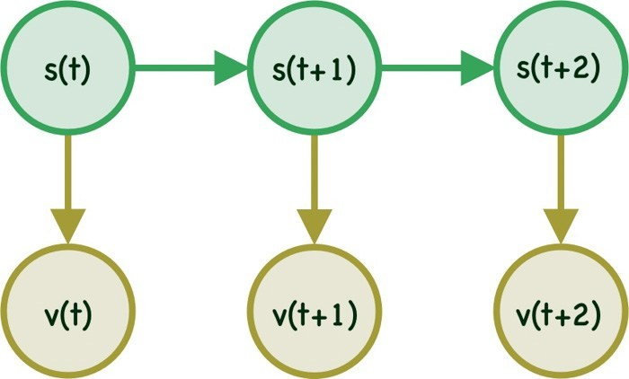

## 
HMM

### 随机过程

- 定义：对于每一个给定的$t_i\in T,i=1,2,\dots,X(t_i)$都是随机变量，则$X(t_i)$称作一个随机过程。或者说随机过程是依赖于时间的一族随机变量

- 解释：

  在自然界中的变化过程可以广义地分为两类。一类为确定性过程，另一类为不确定性过程或随机过程。

  何谓过程呢？通俗讲凡**和时间有关的变化**称为过程。

  如真空中的自由落体运动，有$X(t)=\frac{1}{2}gt^2$，这个函数关系确定了物体在任意时刻离开初点的精确位置，存在必然确定的因果关系，显然X与时间t有关，构成一个过程。这个过程我们把它称为确定性过程。

  另一类过程是没有确定的变化形式，没有必然的变化规律，如商店每天的营业额M，显然是一个不确定量即随机变量，进一步分析知该营业额M还和时间t有关，即M(t)，由此M构成一个过程，这里称这个过程为**随机过程**。

### 马尔可夫过程

**马尔可夫性质**是概率论中的一个概念。当一个随机过程在给定现在状态及所有过去状态情况下，其未来状态的条件概率分布仅依赖于当前状态；换句话说，在给定现在状态时，它与过去状态（即该过程的历史路径）是条件独立的，那么此随机过程即具有**马尔可夫性质**。具有马尔可夫性质的过程通常称之为**马尔可夫过程**。

### 马尔可夫模型

马尔可夫模型用于对随机改变系统(randomly change system)进行建模，也就是系统的状态是随机的类似天气预测这种系统。在马尔可夫模型中，系统的每个状态都是可见的。

状态在t时刻的状态s只与t-1时刻的状态有关称为一阶马尔可夫模型，同理，状态t时刻的状态s与t-1时刻和t-2时刻的状态有关称为二阶马尔可夫模型，以此类推。

#### 转移概率

模型中从一个状态转移到另一个状态的概率称为转移概率（Transition Probability）。若共有三个状态，则对应有9个转移概率。转移概率一般用 $a_{ij}$ 表示，表示在t+1时刻从状态i转移到状态j的概率。使用公式表示为
$$
a_{i j}=p(s(t+1)=j | s(t)=i)
$$

在马尔可夫模型中使用转移概率矩阵`（M*M）`来定义各个转移概率。对于有三个状态的情况，对应的转移概率矩阵为
$$
A=\left[\begin{array}{lll}{a_{11}} & {a_{12}} & {a_{13}} \\ {a_{21}} & {a_{22}} & {a_{23}} \\ {a_{31}} & {a_{32}} & {a_{33}}\end{array}\right]
$$
一个重要的性质为 $\sum_{j=1}^{M} a_{i j}=1 \quad \forall i$ ，在A中有$a_{11}+a_{12}+a_{13}=1$

#### 初始概率

马尔可夫模型的初始概率（t=0）表示为$\pi$ ，是一个M维的行向量，而行向量的每个维度的和要为1，即$\sum_{i=1}^{M}\pi_i=1 \quad \forall i$。

#### 总结

通过以上分析，MM主要由以下参数组成：

- A set of `M states`
- A `transition probability` matrix A
- An `initial probability` distribution π

### HMM

#### 介绍

HMM属于图模型的一种。

在HMM中顾名思义就是不同于MM，HMM的状态(`state`)是被隐藏（`Hidden`）的，称为隐状态。但是每一步 `t`  对应的状态`s(t)` 会对应一个可见的（observable/visible symbol）标志 `v(t)`。HMM的结构可以简单表示为

举一个简单的例子，假设一家赌场有两种不同种类的骰子一种是fair的另一种是unfair的，对于客人来说使用哪种骰子（fair or unfair）并不知道，只知道每次掷出的点数（between 1-6）。对于这种情况，骰子的状态则是`s`，而掷出的点数是`v`。

#### 发射概率(Emission Probability)

假设可观察变量只有两个状态${v_1,v_2}$，每个可观测变量一定是由隐状态发射出来的，每个状态发射到每个可观测变量的概率称为发射概率。记为$b_{jk}$，表示从隐状态j到可观测变量k的概率，即
$$
b_{j k}=p\left(v_{k}(t) | s_{j}(t)\right)
$$
同转移概率矩阵相同，发射概率同样对应发射概率矩阵，若有M个隐状态，C个可观察变量，则发射概率矩阵的形状为`M*C` 。发射概率具有的性质为
$$
\sum_{k=1}^{C} b_{j k}=1 \quad \forall j
$$

#### 三个基本问题

#### 评估问题（Evaluation）

#### 学习问题（Learning ）

#### 解码问题（Decoding）

解码问题：给定一个观测序列和模型，快速计算给定观测序列的概率

### 参考

[1.Introduction to Hidden Markov Model](http://www.adeveloperdiary.com/data-science/machine-learning/introduction-to-hidden-markov-model/)

