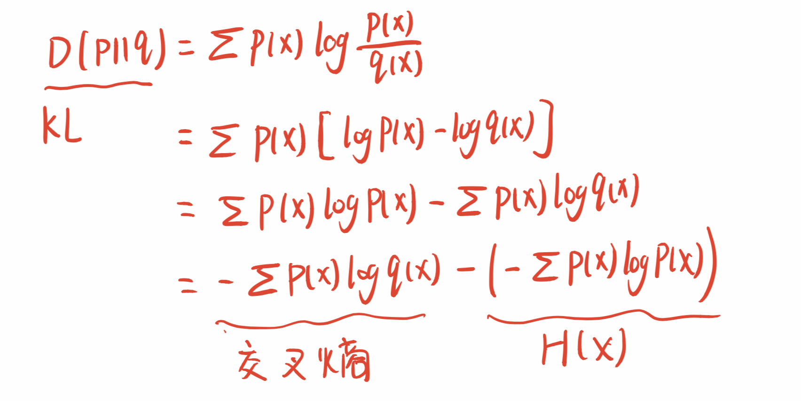
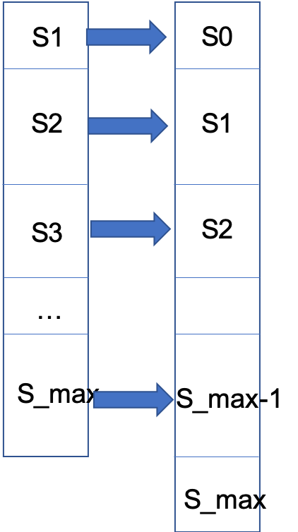
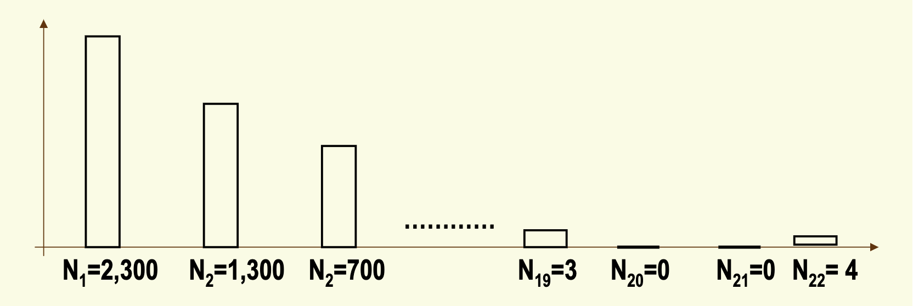

## 
N-gram

### N-gram

- 种类
  - Unigram model
  
    各个词出现的概率是独立的。公式为
  $$
    P\left(w_{1} w_{2} \ldots w_{n}\right) \approx \prod_{i} P\left(w_{i}\right)
  $$
  
  - Bigram model
  
    当前出现只与上一个词有关。公式为
    $$
    P\left(w_{i} | w_{1} w_{2} \ldots w_{i-1}\right) \approx P\left(w_{i} | w_{i-1}\right)
    $$
  
  - N-­‐gram models
  
    根据以上以此类推N-gram model就是与前n个词有关.
  

### 语言评价指标

- 相关概念
  - 熵

    熵又称为自信息，可以视为描述一个随机变量不确定性的数量。关于熵的直观理解详见参考1。

    熵的定义为：
    $$
    H(X) = - \sum_{x\in R}p(x)\log_{2}p(x)
    $$

  - 相对熵

    相对熵也称KL散度(Kullback-Leibler divergence)。是衡量相同事件两个概率分布相对差距的测度。两个概率分布p(x)和q(x)的相对熵定义为：
    $$
    D(p||q) = \sum_{x\in X}p(x)\log_2\frac{p(x)}{q(x)}
    $$
    关于相对熵的理解如下图。

    

    

    

- 评价指标

  - 交叉熵（交叉熵越小，语言模型质量越好）

    交叉熵其实就是上文中推到的相对熵的前半部分，因为不知道正确的分布，使用模型估计出来的分布来代替正确分布所需要的信息量。交叉熵有用的一个原因在于**交叉熵是真实概率分布p的熵的上界**。H(p,m)>=H(p)。因此可以通过使用一个近似模型,并用近似模型逼近真实模型。 

    在NLP领域中，使用下公式作为交叉熵
  $$
    H(p, m)=\lim _{n \rightarrow \infty}-\frac{1}{n} \sum_{W \in L} p\left(w_{1}, \ldots, w_{n}\right) \log m\left(w_{1}, \ldots, w_{n}\right)
  $$
    其中p代表真实概率分布，m代表模型估计的概率。使用Shannon-McMillan-Breiman定理，我们会得到
  $$
    H(p, m)=\lim _{n \rightarrow \infty}-\frac{1}{n} \log m\left(w_{1} w_{2} \ldots w_{n}\right)
  $$
    上式中使用了无限长度的单词序列进行计算的，而在N-gram中我们使用固定的N进行计算，因此最终的计算公式为：
  $$
    H(W)=-\frac{1}{N} \log P\left(w_{1} w_{2} \ldots w_{N}\right)
  $$
  
  
  - 困惑度（与交叉熵度量结果一致）
  
    **perplexity can be seen as the “number of choices” the random variable has.**
  
    困惑度的计算方法是2的交叉熵次方，根据简单的指数对数运算可以推出：
    $$
    P P(W)=P\left(w_{1} w_{2} \ldots w_{N}\right)^{-\frac{1}{N}}
    $$
    

### 数据平滑

- 目的：解决由于数据匮乏（稀疏）引起的零概率事件。

- 方法：从高概率句子分出微小的概率给零概率句子。

- 基本约束：$\sum_{w_{i}} p\left(w_{i} | w_{1}, w_{2}, \cdots, w_{i-1}\right)=1$

- 算法

  - 加法平滑方法

    对于每一种出现的情况出现的次数加一个固定的数值。这样就将没有出现的情况也考虑进去了。

  - 减值法/折扣法

    思想与加法差不多，修改修炼样本中的实际计数，使实际出现的不同事件的概率小于1，将剩下的概率分配给未出现事件。

  - Good-Turing估计法

    Good-Turing方法主要思想是**Use the count of things we’ve seen once to help estimate the count of things we’ve never seen**。实质是将原本出现r+1次的空间平均分配给出现n次的。计算公式为：
    $$
    P_{G T}(x)=(r+1) \frac{N_{r+1}}{N \cdot N_{r}}
    $$
    转换结果如下图所示：

    
    
    对于S_max可以依旧采用MLE对其进行估算。
    
    Good-Turing的不足之处在于当r增加时候会出现holes，如下图：
    
    
    
    解决方法：
    
    - Solution1:设置一个threshold如t=10，对于出现频次较少(r<10)的使用Good-Turing平滑，对于大的直接使用MLE进行估计
    - Solution2:拟合曲线$F(r)=ar^b$，其中b<1。当觉得结果不可靠时通过计算F(r)。
    
    还有需要注意的是通过以上算出来的结果加和并不为1，因此需要进行renormalize。
    
  - Jelinek-Mercer(interpolation)

    JM算法可以看作是对Good-Turing方法的改进，在以上方法中，如C(BURNISH THE) = 0且C(BURNISH THOU) = 0,则使用Good-Turing方法估计出的概率P(THE|BURNISH) =P(THOU|BURNISH)。这是不符合常理的，因为在实际生活中，The比Thou出现的更为频繁，因此引入了JM平滑方法。希望把 bigram 和 unigram 结合起来，interpolate 就是这样一种方法。计算公式为：
  $$
    \begin{aligned} p\left(w_{n} | w_{n-1} w_{n-2}\right) &=\lambda_{1} p\left(w_{n} | w_{n-1} w_{n-2}\right) \\ &+\lambda_{2} p\left(w_{n} | w_{n-1}\right) \\ &+\lambda_{3} p\left(w_{n}\right) \\ \sum_{i} \lambda_{i}=1 \end{aligned}
  $$
    这种插值其实是一个递归的形式，我们可以把每个 lambda 看成上下文的函数，如果对于一个特定的 bigram 有特定的计数，假定 trigram 的计数是基于 bigram 的，那么这样的办法将更可靠，因此，可以使 trigram 的 lambda 值更高，给 trigram 更高权重。
  $$
    \begin{aligned} p\left(w_{n} | w_{n-1} w_{n-2}\right) &=\lambda_{1}\left(w_{n-2}^{n-1}\right) p\left(w_{n} | w_{n-1} w_{n-2}\right) \\ &+\lambda_{2}\left(w_{n-2}^{n-1}\right) p\left(w_{n} | w_{n-1}\right) \\ &+\lambda_{3}\left(w_{n-2}^{n-1}\right) p\left(w_{n}\right) \end{aligned}
  $$
    

    

  - Katz平滑方法(Backoff)
  
    Backoff的总体思路是对于每个计数 r > 0 的n元文法的出现次数减值, 把因减值而节省下来的剩余概率根据低阶的 (n-1)gram 分配给未见事件。以二元语法为例，计算公式为
    $$
    p_{\mathrm{katz}}\left(w_{i} | w_{i-1}\right)=\left\{\begin{array}{ll}{d_{r} \frac{C\left(w_{i-1} w_{i}\right)}{C\left(w_{i-1}\right)}} & {\text { if } C\left(w_{i-1} w_{i}\right)=r>0} \\ {\alpha\left(w_{i-1}\right) p_{\mathrm{ML}}\left(w_{i}\right)} & {\text { if } C\left(w_{i-1} w_{i}\right)=0}\end{array}\right.
    $$
    对于r大于0的，采用dr这个折扣率进行折扣，对于出现次数为0的，根据unigram进行分配。其中折扣率$d_r$约等于$\frac{r^*}{r}$通过good-Turing计算得来的。
  
  - Kneser-Ney平滑
  
  - 修正的Kneser-Ney平滑

### 语言模型的缺陷

-  在训练语言模型时所采用的语料往往来自多种不同的领域，这些综合性语料难以反映不同领域之间在语言使用规律上的差异，而语言模型恰恰对于训练文本的类型、主题 和风格等都十分敏感。
- n 元语言模型的独立性假设的前提是一个文本中的当前词出现的概率只不它前面相邻 的n-1 个词相关，但这种假设在很多情况下是明显不成立的。

### 模型的自适应

- 基于缓存的语言模型
- 基于混合方法的语言模型
- 基于最大熵的语言模型

### 参考

[1.The intuition behind Shannon’s Entropy](https://towardsdatascience.com/the-intuition-behind-shannons-entropy-e74820fe9800)

[2.NLP中的基本概念]([https://work.padeoe.com/notes/1.Introduction%20to%20NLP&N%20Gram.html](https://work.padeoe.com/notes/1.Introduction to NLP&N Gram.html))

[3.Language Modeling—Introduction to N-grams](http://www.stanford.edu/class/cs124/lec/languagemodeling2017.pdf)

[4.Language model-Good-turing](https://www.csd.uwo.ca/courses/CS4442b/L9-NLP-LangModels.pdf)

[5.Smoothing](https://nlp.stanford.edu/~wcmac/papers/20050421-smoothing-tutorial.pdf)

[6.平滑方法小结]([http://www.shuang0420.com/2017/03/24/NLP%20%E7%AC%94%E8%AE%B0%20-%20%E5%B9%B3%E6%BB%91%E6%96%B9%E6%B3%95(Smoothing)%E5%B0%8F%E7%BB%93/](http://www.shuang0420.com/2017/03/24/NLP 笔记 - 平滑方法(Smoothing)小结/)

[7.language models](http://www.statmt.org/book/slides/07-language-models.pdf)

[8.平滑总结](https://blog.csdn.net/baimafujinji/article/details/51297802)

9.宗成庆PPT

